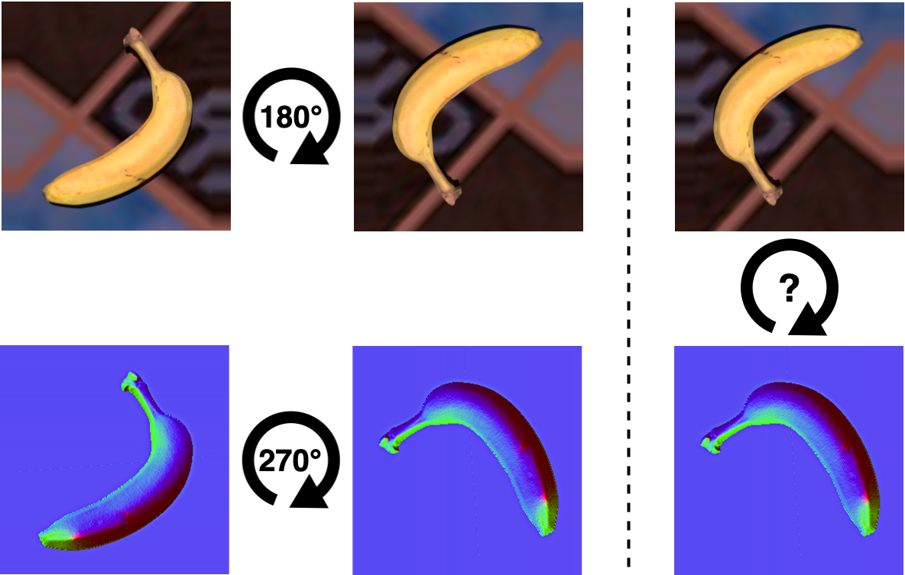

# Relative Rotation
Original implementation of the paper "Unsupervised Domain Adaptation through Inter-modal Rotation for RGB-D Object Recognition": https://arxiv.org/pdf/2004.10016.pdf



### Requirements:
* Python 3.6.5
* CUDA 10.1 (depends on your nvidia drivers)
* See python requirements in requirements.txt
* Docker + nvidia-docker [optional]: https://github.com/NVIDIA/nvidia-docker

### Instructions:
1. Download the datasets (see link below) and extract them in directory <dataset_dir>
[Skip to point (4) to run w/o docker]
2. To execute the code within a docker container, run ```docker build -t <container_name> .```
3. Start the container with ```docker run -it --runtime=nvidia --shm-size 16G -v <dataset_dir>:<dataset_dir> <container_name> bash```
4. To train the network, run: 
```
python code/train.py \
--source synHB \
--target valHB \
--epoch 40 \
--batch_size 64 \
--lr 0.0003 \
--weight_rot 1 \
--weight_ent 0.1 \
--data_root_source '<dataset_dir>/HB_Syn_crops_square' \
--train_file_source '<dataset_dir>/HB_Syn_crops_square/HB_Syn_crops_25k-split_sync_train1.txt' \
--test_file_source '<dataset_dir>/HB_Syn_crops_square/HB_Syn_crops_25k-split_sync_test1.txt' \
--data_root_target '<dataset_dir>/HB_val_crops_square' \
--train_file_target '<dataset_dir>/HB_val_crops_square/HB_val_crops_25k-split_sync.txt' \
--test_file_target '<dataset_dir>/HB_val_crops_square/HB_val_crops_25k-split_sync.txt'
```
5. To evaluate a trained model, run: 
```
python code/eval.py \
--source synHB \
--target valHB \
--epoch 40 \
--batch_size 64 \
--lr 0.0003 \
--weight_rot 1 \
--weight_ent 0.1 \
--data_root_source '<dataset_dir>/HB_Syn_crops_square' \
--train_file_source '<dataset_dir>/HB_Syn_crops_square/HB_Syn_crops_25k-split_sync_train1.txt' \
--test_file_source '<dataset_dir>/HB_Syn_crops_square/HB_Syn_crops_25k-split_sync_test1.txt' \
--data_root_target '<dataset_dir>/HB_val_crops_square' \
--train_file_target '<dataset_dir>/HB_val_crops_square/HB_val_crops_25k-split_sync.txt' \
--test_file_target '<dataset_dir>/HB_val_crops_square/HB_val_crops_25k-split_sync.txt'
```

### Download:
For more information about the datasets we presented and used for our experiments, please visit our webpage  https://www.acin.tuwien.ac.at/vision-for-robotics/software-tools/synthetic-to-real-rgbd-datasets/
* synHB (1.3 GB): https://data.acin.tuwien.ac.at/index.php/s/NwHmnWpVmY8IHAN
* realHB (2.2 GB): https://data.acin.tuwien.ac.at/index.php/s/xwNoPTvDDp2I32q

### Contributors:
* Mohammad Reza Loghmani - email: loghmani@acin.tuwien.ac.at
* Luca Robbiano - email: luca.robbiano@studenti.polito.it

### Citation:
```
@article{loghmani2020unsupervised,
  title={Unsupervised Domain Adaptation through Inter-modal Rotation for RGB-D Object Recognition},
  author={Loghmani, Mohammad Reza and Robbiano, Luca and Planamente, Mirco and Park, Kiru and Caputo, Barbara and Vincze, Markus},
  journal={arXiv preprint arXiv:2004.10016},
  year={2020}
}
```
